# MONITORINGv2 — Sistem Monitoring PKL SMKN 1 Subang

**Dokumentasi Proyek**  
*Versi 2.0 — 2026*

---

## Daftar Isi

1. [Ringkasan Proyek](#1-ringkasan-proyek)
2. [Software Requirements Specification (SRS)](#2-software-requirements-specification-srs)
   - 2.1 [Tujuan](#21-tujuan)
   - 2.2 [Ruang Lingkup](#22-ruang-lingkup)
   - 2.3 [Definisi dan Istilah](#23-definisi-dan-istilah)
   - 2.4 [Stakeholder dan Pengguna](#24-stakeholder-dan-pengguna)
   - 2.5 [Fitur Fungsional per Role](#25-fitur-fungsional-per-role)
   - 2.6 [Kebutuhan Non-Fungsional](#26-kebutuhan-non-fungsional)
   - 2.7 [Batasan Sistem](#27-batasan-sistem)
3. [Arsitektur Sistem](#3-arsitektur-sistem)
4. [Diagram-Diagram](#4-diagram-diagram)
   - 4.1 [Use Case Diagram](#41-use-case-diagram)
   - 4.2 [Entity Relationship Diagram (ERD)](#42-entity-relationship-diagram-erd)
   - 4.3 [Class Diagram](#43-class-diagram)
   - 4.4 [Activity Diagram](#44-activity-diagram)
   - 4.5 [Sequence Diagram](#45-sequence-diagram)
   - 4.6 [Deployment Diagram](#46-deployment-diagram)
   - 4.7 [Data Flow Diagram (DFD)](#47-data-flow-diagram-dfd)
5. [Struktur Basis Data](#5-struktur-basis-data)
6. [API Endpoint Reference](#6-api-endpoint-reference)
7. [Stack Teknologi](#7-stack-teknologi)
8. [Struktur Direktori](#8-struktur-direktori)

---

## 1. Ringkasan Proyek

**MONITORINGv2** adalah sistem informasi berbasis web untuk memantau kegiatan Praktik Kerja Lapangan (PKL) siswa SMKN 1 Subang. Sistem ini menggantikan versi sebelumnya dengan menghadirkan pengalaman pengguna yang lebih modern, premium, dan interaktif — mencakup UI dengan tema gradien, efek glassmorphism, animasi halus, dan dashboard yang informatif.

Sistem melayani **empat aktor** dengan portal masing-masing:

| Role | Deskripsi |
|------|-----------|
| **Admin** | Mengelola seluruh data master, memantau kegiatan PKL, menyetujui registrasi, dan menghasilkan laporan |
| **Siswa** | Melakukan presensi berbasis GPS, mengisi logbook harian, mengajukan izin, dan mengunggah laporan |
| **Guru** | Memantau siswa bimbingan, mereview logbook, menyetujui izin, menilai siswa, dan mereview laporan |
| **Perusahaan** | Menilai logbook siswa, memantau progres, dan memberikan feedback |

---

## 2. Software Requirements Specification (SRS)

### 2.1 Tujuan

Sistem ini dibangun untuk mendigitalkan seluruh proses monitoring PKL yang sebelumnya dikelola secara manual atau semi-digital. Tujuan utamanya adalah:

1. Menyediakan platform terpusat untuk memantau kehadiran dan aktivitas siswa selama PKL
2. Memvalidasi kehadiran siswa secara real-time menggunakan teknologi geolokasi (GPS)
3. Menjembatani komunikasi antara sekolah, siswa, dan perusahaan mitra
4. Menghasilkan laporan PKL yang akurat dan dapat diekspor (Excel)
5. Meningkatkan transparansi dan akuntabilitas pelaksanaan PKL

### 2.2 Ruang Lingkup

| Aspek | Cakupan |
|-------|---------|
| **Domain** | Manajemen PKL SMK |
| **Platform** | Web (Responsive, SPA) |
| **Target Pengguna** | Admin sekolah, Guru pembimbing, Siswa PKL, Pembimbing Perusahaan |
| **Metode Presensi** | Check-in/check-out berbasis GPS geofencing |
| **Laporan** | Excel (.xlsx) untuk absensi, logbook, ringkasan siswa, dan nilai |
| **Notifikasi** | Notifikasi in-app untuk approval/rejection |

### 2.3 Definisi dan Istilah

| Istilah | Definisi |
|---------|----------|
| PKL | Praktik Kerja Lapangan — program magang wajib siswa SMK |
| Geofencing | Teknologi pembatas geografis virtual untuk validasi lokasi |
| Logbook | Catatan kegiatan harian siswa selama PKL |
| Placement | Penempatan siswa ke perusahaan mitra |
| Check-in/out | Proses pencatatan kehadiran masuk dan pulang |
| Final Report | Laporan akhir PKL yang dikumpulkan siswa |
| Haversine | Rumus matematika untuk menghitung jarak antar titik koordinat |
| Sanctum | Paket Laravel untuk autentikasi API berbasis token |
| Glassmorphism | Efek desain UI dengan latar transparan dan blur |

### 2.4 Stakeholder dan Pengguna

| Stakeholder | Peran |
|-------------|-------|
| **SMKN 1 Subang** | Pemilik sistem (sekolah) |
| **Admin** | Operator sistem dari pihak sekolah |
| **Guru Pembimbing (Guru)** | Wali kelas/pembimbing PKL |
| **Siswa PKL (Siswa)** | Siswa kelas 11-12 yang menjalani PKL |
| **Pembimbing Perusahaan (Perusahaan)** | Pihak mitra yang membimbing siswa |
| **Developer** | Tim pengembang dan pemelihara sistem |

### 2.5 Fitur Fungsional per Role

#### Admin

| Kode | Fitur | Deskripsi |
|------|-------|-----------|
| ADM-01 | Dashboard Admin | Melihat statistik: total siswa, guru, perusahaan, placement aktif, grafik kehadiran |
| ADM-02 | Manajemen User | CRUD untuk pengguna (siswa, guru) |
| ADM-03 | Manajemen Perusahaan | CRUD data perusahaan mitra (nama, alamat, koordinat GPS, radius) |
| ADM-04 | Manajemen Kelas | CRUD data kelas, jurusan, dan wali kelas |
| ADM-05 | Manajemen Placement | Menempatkan siswa ke perusahaan tertentu |
| ADM-06 | Approve Registrasi | Menyetujui/menolak pendaftaran akun baru |
| ADM-07 | Monitoring PKL | Melihat kehadiran, logbook, dan progres siswa secara real-time |
| ADM-08 | Peta Distribusi | Melihat sebaran siswa di peta interaktif (Leaflet) |
| ADM-09 | Laporan Ekspor | Export Excel: absensi, logbook, ringkasan, nilai |
| ADM-10 | Penilaian | Input dan review nilai siswa |
| ADM-11 | Pengaturan | Konfigurasi umum, profil sekolah, tahun akademik, radius presensi |

#### Siswa

| Kode | Fitur | Deskripsi |
|------|-------|-----------|
| SIS-01 | Dashboard Siswa | Melihat statistik pribadi: total hadir, logbook, izin |
| SIS-02 | Presensi GPS | Check-in/out dengan validasi lokasi (harus dalam radius perusahaan) |
| SIS-03 | Logbook Harian | CRUD catatan kegiatan harian dengan lampiran |
| SIS-04 | Izin/Sakit | Mengajukan izin atau sakit dengan lampiran bukti |
| SIS-05 | Upload Laporan | Mengunggah laporan PKL (file) |
| SIS-06 | Final Report | Submit laporan akhir PKL dengan judul dan abstrak |
| SIS-07 | Info Perusahaan | Melihat data perusahaan tempat PKL |
| SIS-08 | Riwayat | Melihat histori presensi dan logbook |

#### Guru

| Kode | Fitur | Deskripsi |
|------|-------|-----------|
| GRU-01 | Dashboard Guru | Statistik siswa bimbingan, grafik kehadiran |
| GRU-02 | Monitoring Siswa | Melihat daftar siswa dan detail progres masing-masing |
| GRU-03 | Review Logbook | Menyetujui/menolak logbook siswa dengan feedback |
| GRU-04 | Approval Izin | Menyetujui/menolak izin/sakit siswa |
| GRU-05 | Penilaian | Memberikan nilai: kehadiran, logbook, laporan, sikap, performa, disiplin |
| GRU-06 | Rekap Absensi | Melihat rekap kehadiran siswa bimbingan |
| GRU-07 | Review Laporan | Menyetujui/menolak laporan PKL siswa |
| GRU-08 | Export Laporan | Download Excel absensi, logbook, penilaian |

#### Perusahaan

| Kode | Fitur | Deskripsi |
|------|-------|-----------|
| PRS-01 | Dashboard Perusahaan | Statistik siswa bimbingan |
| PRS-02 | Penilaian Logbook | Memberikan grade dan feedback pada logbook siswa |
| PRS-03 | Monitoring Progres | Melihat progres siswa bimbingan |
| PRS-04 | Laporan | Export laporan logbook dan progres |

### 2.6 Kebutuhan Non-Fungsional

| Kode | Kebutuhan | Deskripsi |
|------|-----------|-----------|
| NFR-01 | Keamanan | Autentikasi menggunakan token Sanctum, proteksi CSRF, password hashing |
| NFR-02 | Performa | Waktu muat halaman < 3 detik, optimasi dengan Vite bundling |
| NFR-03 | Responsivitas | Tampilan optimal di desktop dan mobile |
| NFR-04 | Reliabilitas | Validasi data di sisi klien dan server |
| NFR-05 | Maintainability | Kode terstruktur dengan pola MVC (Laravel) dan component-based (Vue) |
| NFR-06 | Skalabilitas | Arsitektur API memungkinkan pengembangan klien mobile di masa depan |
| NFR-07 | Akurasi | Presisi koordinat GPS hingga 8 desimal |
| NFR-08 | Backup | Database dump dapat diekspor melalui phpMyAdmin |

### 2.7 Batasan Sistem

1. Presensi hanya dapat dilakukan jika siswa berada dalam radius geofencing perusahaan (diukur dengan rumus Haversine)
2. Sistem tidak mendukung autentikasi biometrik
3. Tidak ada integrasi real-time WebSocket (notifikasi hanya in-app via polling/refresh)
4. Sistem tidak menyediakan fitur chat antara siswa dan guru
5. Unggahan laporan terbatas pada format PDF dan gambar

---

## 3. Arsitektur Sistem

### 3.1 Arsitektur Umum

```
+---------------------------------------------------------------+
|                         CLIENT (Browser)                        |
|  +-----------------------------------------------------------+  |
|  |              Vue 3 Single Page Application                |  |
|  |  +------------------+  +------------------+  +----------+ |  |
|  |  |  Pinia Store     |  |  Vue Router      |  | Axios    | |  |
|  |  |  (State Mgmt)    |  |  (Navigation)    |  | (HTTP)   | |  |
|  |  +------------------+  +------------------+  +----------+ |  |
|  |  +--------------------------------------------------------+  |
|  |  |  Components & Views (per Role)                          | |
|  |  |  [AdminLayout] [GuruLayout] [SiswaLayout] [Perusahaan] | |
|  |  +--------------------------------------------------------+ |
|  +-----------------------------------------------------------+  |
|                          |  HTTPS / JSON                        |
+---------------------------------------------------------------+
                           |
+---------------------------------------------------------------+
|                     LARAVEL REST API (Backend)                  |
|  +-----------------------------------------------------------+  |
|  |  Routes (api.php)  -->  Middleware (auth:sanctum)          |  |
|  |         |                                                  |  |
|  |  Controllers (Api/*)                                       |  |
|  |    - AuthController              - Admin/*Controller       |  |
|  |    - Guru/*Controller            - Siswa/*Controller       |  |
|  |    - Perusahaan/*Controller                              |  |
|  |         |                                                  |  |
|  |  Models (Eloquent ORM)                                     |  |
|  |    - User, Role, Attendance, Logbook, Permission, ...      |  |
|  |         |                                                  |  |
|  |  Database Layer (MySQL)                                    |  |
|  +-----------------------------------------------------------+  |
+---------------------------------------------------------------+
```

### 3.2 Pola Arsitektur

| Aspek | Pendekatan |
|-------|-----------|
| **Pola** | RESTful API + SPA (Frontend terpisah) |
| **Backend** | Model-View-Controller (MVC) — Laravel |
| **Frontend** | Component-based architecture — Vue 3 |
| **State Management** | Centralized store — Pinia |
| **Autentikasi** | Token-based stateless — Laravel Sanctum |
| **Data Flow** | Unidirectional: View -> Action -> API -> Response -> Store -> View |

### 3.3 Alur Data Presensi GPS

```
Siswa                   Browser                      Laravel API                   Database
  |                        |                             |                            |
  |-- Klik Check-in ------>|                             |                            |
  |                        |-- POST /api/siswa/attendance/check-in                  |
  |                        |    (kirim lat, lng via Geolocation API)               |
  |                        |--------->|                                             |
  |                        |           |-- Ambil data perusahaan siswa              |
  |                        |           |----------------------->|                   |
  |                        |           |                        |-- Query company    |
  |                        |           |                        |--- latitude,longitude,radius
  |                        |           |<-----------------------|                   |
  |                        |           |                                             |
  |                        |           |-- Hitung jarak dengan Haversine formula    |
  |                        |           |   jarak = haversine(lat1,lng1, lat2,lng2)  |
  |                        |           |                                             |
  |                        |           |-- Validasi: jarak <= radius ?              |
  |                        |           |   YES -> is_valid_location = true          |
  |                        |           |   NO  -> is_valid_location = false         |
  |                        |           |                                             |
  |                        |           |-- Tentukan status: present / late          |
  |                        |           |                                             |
  |                        |           |-- Simpan record attendance                 |
  |                        |           |----------------------->|                   |
  |                        |<-------- |                                             |
  |                        | Response JSON                                          |
  |<-----------------------|           |                                             |
```

---

## 4. Diagram-Diagram

### 4.1 Use Case Diagram

```mermaid
graph TB
    %% Actors
    Admin((Admin))
    Guru((Guru Pembimbing))
    Siswa((Siswa PKL))
    Perusahaan((Pembimbing Perusahaan))

    %% System Boundary
    subgraph "Sistem Monitoring PKL SMKN 1 Subang"
        %% Admin Use Cases
        A1[Kelola User]
        A2[Kelola Perusahaan]
        A3[Kelola Kelas]
        A4[Kelola Placement]
        A5[Approve Registrasi]
        A6[Monitoring PKL]
        A7[Lihat Peta Distribusi]
        A8[Export Laporan Excel]
        A9[Kelola Pengaturan]
        A10[Kelola Penilaian]

        %% Guru Use Cases
        G1[Dashboard]
        G2[Monitoring Siswa]
        G3[Review Logbook]
        G4[Approval Izin]
        G5[Penilaian Siswa]
        G6[Rekap Absensi]
        G7[Review Laporan]

        %% Siswa Use Cases
        S1[Presensi Check-in/out]
        S2[Kelola Logbook]
        S3[Ajukan Izin/Sakit]
        S4[Upload Laporan]
        S5[Submit Final Report]
        S6[Lihat Info Perusahaan]

        %% Perusahaan Use Cases
        P1[Penilaian Logbook]
        P2[Monitoring Progres]
        P3[Export Laporan]
    end

    %% Relationships
    Admin --> A1
    Admin --> A2
    Admin --> A3
    Admin --> A4
    Admin --> A5
    Admin --> A6
    Admin --> A7
    Admin --> A8
    Admin --> A9
    Admin --> A10

    Guru --> G1
    Guru --> G2
    Guru --> G3
    Guru --> G4
    Guru --> G5
    Guru --> G6
    Guru --> G7

    Siswa --> S1
    Siswa --> S2
    Siswa --> S3
    Siswa --> S4
    Siswa --> S5
    Siswa --> S6

    Perusahaan --> P1
    Perusahaan --> P2
    Perusahaan --> P3
```

#### 4.1.1 Deskripsi Use Case

| Use Case | Aktor | Deskripsi Singkat |
|----------|-------|-------------------|
| Kelola User | Admin | CRUD pengguna (siswa, guru) |
| Kelola Perusahaan | Admin | CRUD data perusahaan mitra |
| Kelola Kelas | Admin | CRUD kelas, jurusan, wali kelas |
| Kelola Placement | Admin | Menempatkan siswa ke perusahaan |
| Approve Registrasi | Admin | Menerima/menolak pendaftaran akun |
| Monitoring PKL | Admin | Pantau kehadiran, logbook, progres |
| Lihat Peta Distribusi | Admin | Sebaran siswa di peta interaktif |
| Export Laporan Excel | Admin, Guru | Download Excel absensi/logbook/nilai |
| Presensi Check-in/out | Siswa | Absen masuk/pulang dengan GPS |
| Kelola Logbook | Siswa | CRUD catatan kegiatan harian |
| Ajukan Izin/Sakit | Siswa | Kirim permohonan izin/sakit |
| Review Logbook | Guru, Perusahaan | Lihat, setujui/tolak, beri feedback |
| Penilaian Siswa | Guru, Admin | Input nilai multidimensi |

### 4.2 Entity Relationship Diagram (ERD)

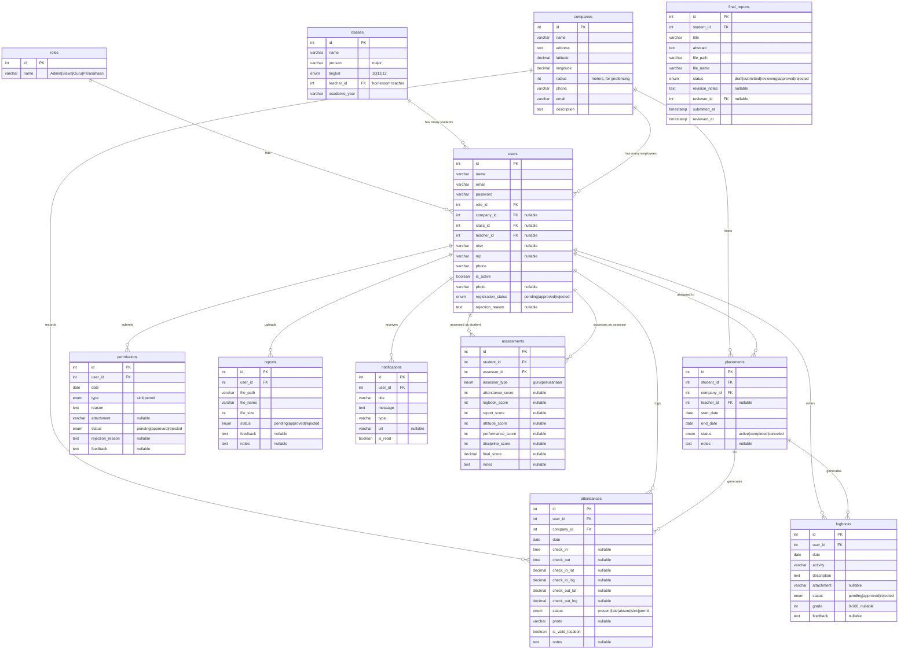

### 4.3 Class Diagram

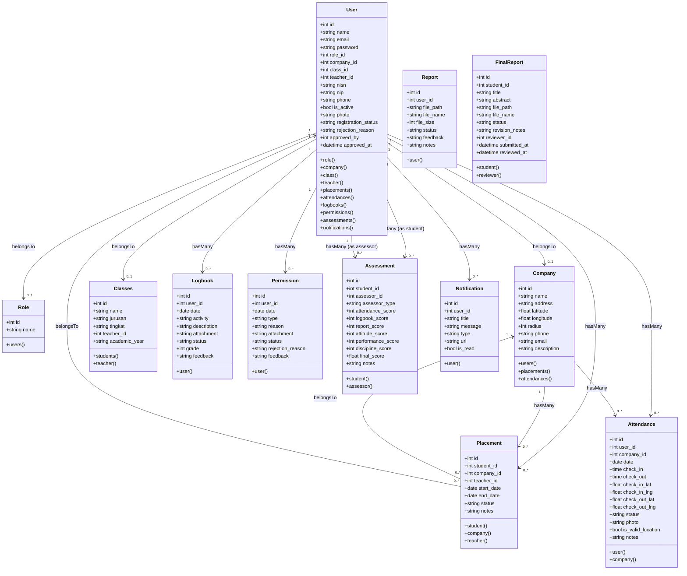

### 4.4 Activity Diagram

#### 4.4.1 Presensi Check-in Siswa

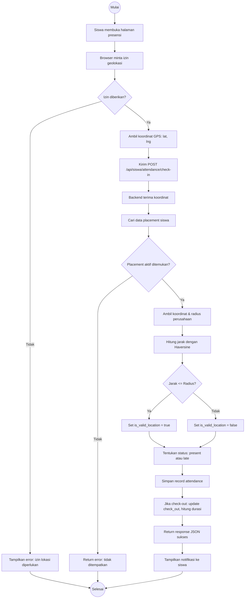

#### 4.4.2 Alur Review Logbook oleh Guru

```mermaid
flowchart TD
    Start((Mulai)) --> A[Guru buka menu Logbook Review]
    A --> B[GET /api/guru/logbooks/pending]
    B --> C[Tampilkan daftar logbook siswa yang pending]
    C --> D[Guru klik salah satu logbook]
    D --> E[GET /api/guru/logbooks/{id}]
    E --> F[Tampilkan detail logbook + lampiran]
    F --> G{Guru memilih aksi?}
    G -->|Setuju| H[PUT /api/guru/logbooks/{id}/approve]
    G -->|Tolak| I[PUT /api/guru/logbooks/{id}/reject]
    G -->|Review dengan catatan| J[PUT /api/guru/logbooks/{id}/review]
    H --> K[Status logbook = approved]
    I --> L[Status logbook = rejected]
    J --> M[Simpan feedback dari guru]
    K --> N[Buat notifikasi untuk siswa]
    L --> N
    M --> N
    N --> O[Tampilkan hasil sukses ke guru]
    O --> End((Selesai))
```

#### 4.4.3 Alur Registrasi dan Approve

```mermaid
flowchart TD
    Start((Mulai)) --> A[User buka halaman register]
    A --> B[Pilih role: Siswa/Guru/Perusahaan]
    B --> C[Isi formulir pendaftaran]
    C --> D[POST /api/register/{role}]
    D --> E[Validasi input server-side]
    E --> F{Valid?}
    F -->|Tidak| G[Return error validasi]
    G --> C
    F -->|Ya| H[Buat user dgn status = pending]
    H --> I[Return: registrasi berhasil, tunggu approval]
    I --> EndUser((Selesai - User))

    subgraph Admin Approval
        J[Admin buka menu Registrations]
        J --> K[GET /api/admin/registrations/]
        K --> L[Tampilkan daftar registrasi pending]
        L --> M[Admin review detail pendaftar]
        M --> N{Setujui?}
        N -->|Ya| O[POST /api/admin/registrations/{id}/approve]
        N -->|Tidak| P[POST /api/admin/registrations/{id}/reject]
        O --> Q[User.is_active = true, notif terkirim]
        P --> R[User.is_active = false, rejection_reason diisi]
        Q --> S((Selesai))
        R --> S
    end

    I --> J
```

### 4.5 Sequence Diagram

#### 4.5.1 Login

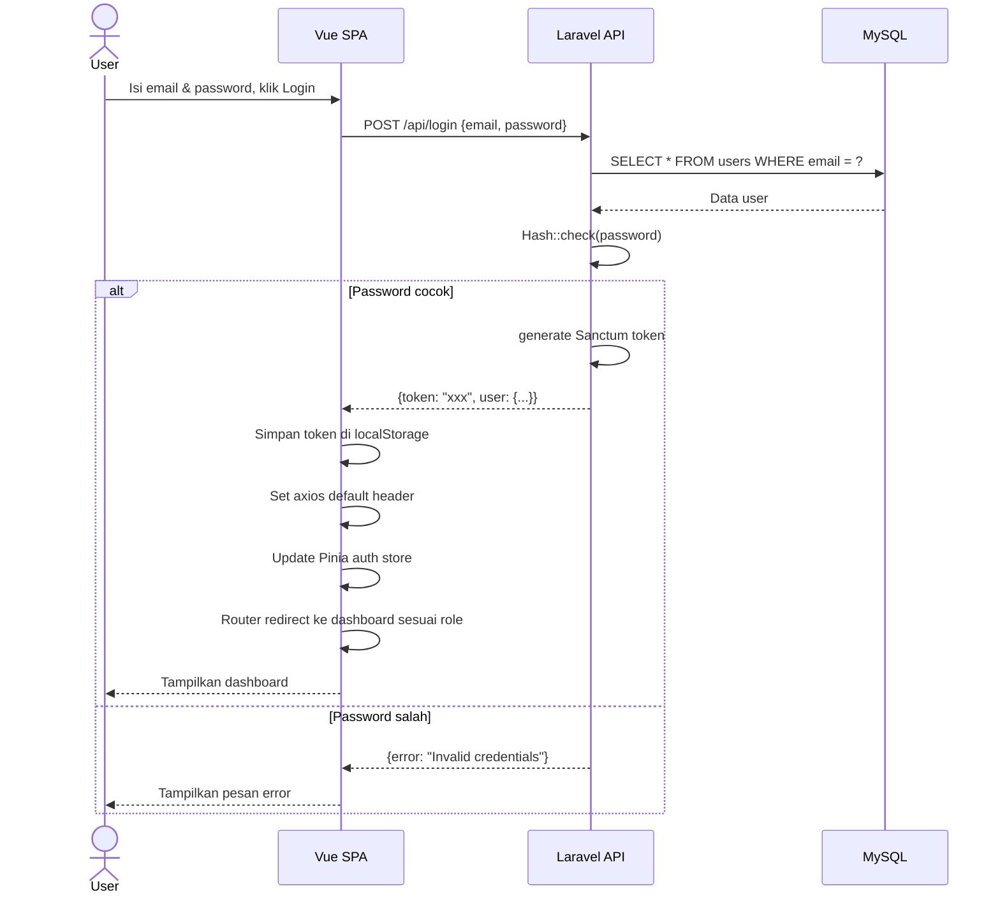

#### 4.5.2 Presensi Check-in

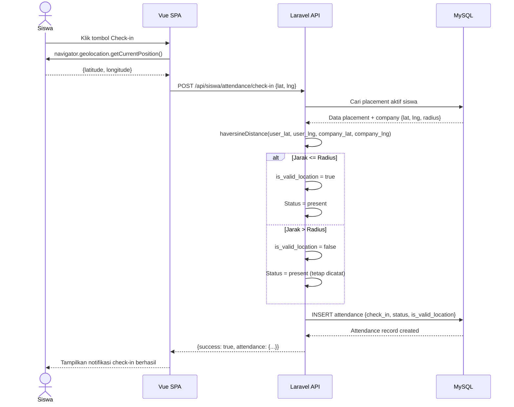

#### 4.5.3 Review Logbook

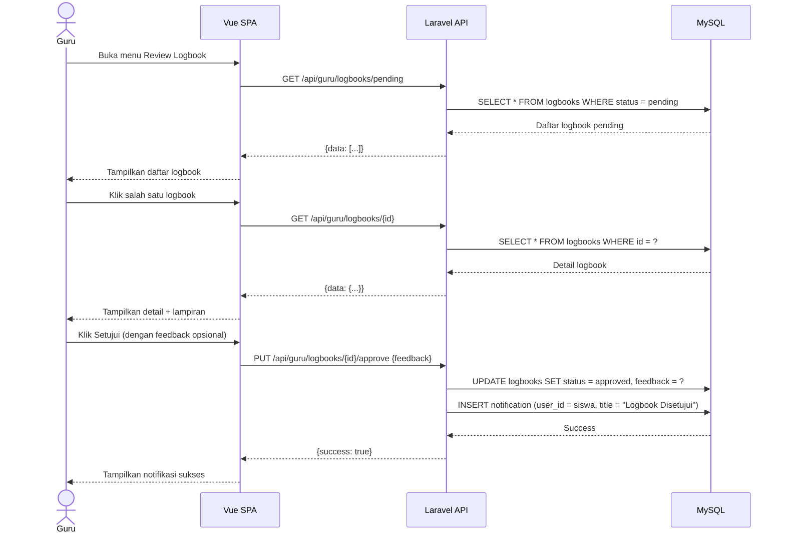

### 4.6 Deployment Diagram

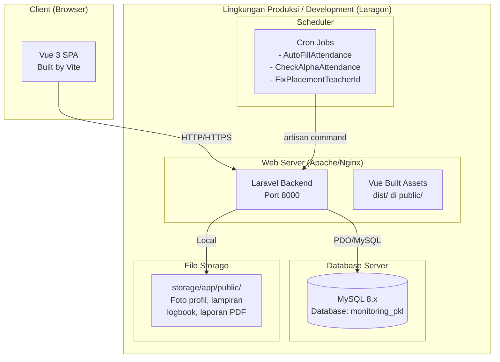

### 4.7 Data Flow Diagram (DFD)

#### Level 0 (Context Diagram)

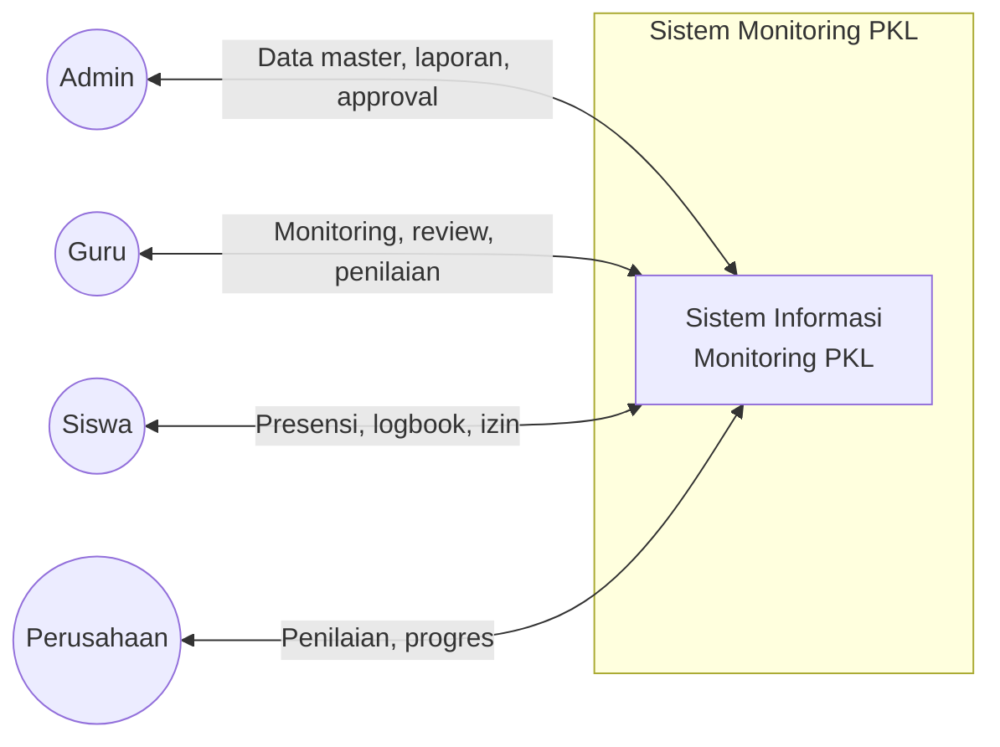

#### Level 1

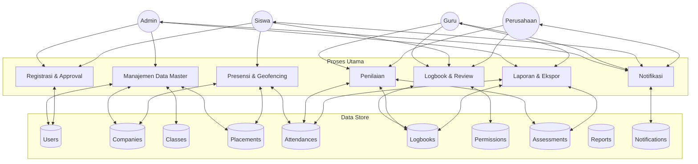

---

## 5. Struktur Basis Data

### 5.1 Diagram Relasi Tabel

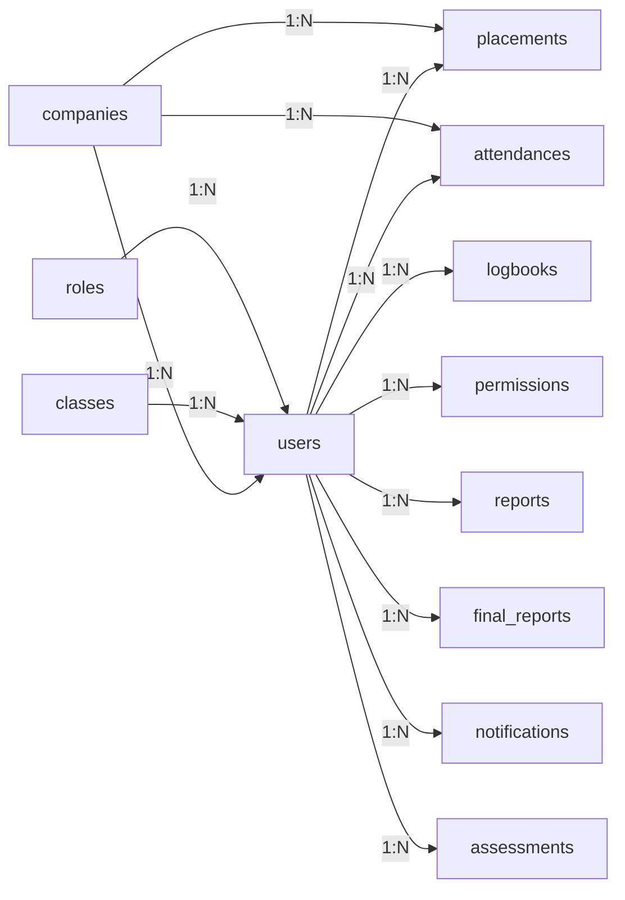

### 5.2 Deskripsi Tabel

#### `roles`

| Kolom | Tipe | Keterangan |
|-------|------|------------|
| id | BIGINT UNSIGNED PK | Auto increment |
| name | VARCHAR(255) | Nama role: Admin, Siswa, Guru, Perusahaan |
| created_at | TIMESTAMP | |
| updated_at | TIMESTAMP | |

#### `users`

| Kolom | Tipe | Keterangan |
|-------|------|------------|
| id | BIGINT UNSIGNED PK | Auto increment |
| name | VARCHAR(255) | Nama lengkap |
| email | VARCHAR(255) UNIQUE | Email login |
| password | VARCHAR(255) | BCrypt hash |
| role_id | BIGINT UNSIGNED FK → roles.id | |
| company_id | BIGINT UNSIGNED FK → companies.id | Nullable, untuk role Perusahaan |
| class_id | BIGINT UNSIGNED FK → classes.id | Nullable, untuk role Siswa |
| teacher_id | BIGINT UNSIGNED FK → users.id | Nullable, wali kelas untuk Siswa |
| nisn | VARCHAR(255) | Nullable, Nomor Induk Siswa Nasional |
| nip | VARCHAR(255) | Nullable, untuk Guru |
| phone | VARCHAR(255) | Nomor telepon |
| is_active | BOOLEAN | Status aktif/nonaktif |
| photo | VARCHAR(255) | Nullable, path foto profil |
| registration_status | ENUM('pending','approved','rejected') | Status registrasi |
| rejection_reason | TEXT | Nullable, alasan penolakan |
| approved_by | BIGINT UNSIGNED FK → users.id | Nullable |
| approved_at | TIMESTAMP | Nullable |
| remember_token | VARCHAR(100) | Laravel default |
| created_at | TIMESTAMP | |
| updated_at | TIMESTAMP | |

#### `companies`

| Kolom | Tipe | Keterangan |
|-------|------|------------|
| id | BIGINT UNSIGNED PK | Auto increment |
| name | VARCHAR(255) | Nama perusahaan |
| address | TEXT | Alamat lengkap |
| latitude | DECIMAL(10,8) | Koordinat lintang |
| longitude | DECIMAL(11,8) | Koordinat bujur |
| radius | INT | Radius geofencing dalam meter |
| phone | VARCHAR(255) | Nomor telepon perusahaan |
| email | VARCHAR(255) | Email perusahaan |
| description | TEXT | Deskripsi perusahaan |
| created_at | TIMESTAMP | |
| updated_at | TIMESTAMP | |

#### `classes`

| Kolom | Tipe | Keterangan |
|-------|------|------------|
| id | BIGINT UNSIGNED PK | Auto increment |
| name | VARCHAR(255) | Nama kelas (contoh: XI RPL 1) |
| jurusan | VARCHAR(255) | Jurusan (RPL, TKJ, MM, dll) |
| tingkat | ENUM('10','11','12') | Tingkat kelas |
| teacher_id | BIGINT UNSIGNED FK → users.id | Wali kelas |
| academic_year | VARCHAR(255) | Tahun ajaran |
| created_at | TIMESTAMP | |
| updated_at | TIMESTAMP | |

#### `placements`

| Kolom | Tipe | Keterangan |
|-------|------|------------|
| id | BIGINT UNSIGNED PK | Auto increment |
| student_id | BIGINT UNSIGNED FK → users.id | Siswa |
| company_id | BIGINT UNSIGNED FK → companies.id | Perusahaan tujuan |
| teacher_id | BIGINT UNSIGNED FK → users.id | Nullable, guru pembimbing |
| start_date | DATE | Tanggal mulai PKL |
| end_date | DATE | Tanggal selesai PKL |
| status | ENUM('active','completed','canceled') | Status penempatan |
| notes | TEXT | Nullable, catatan tambahan |
| created_at | TIMESTAMP | |
| updated_at | TIMESTAMP | |

#### `attendances`

| Kolom | Tipe | Keterangan |
|-------|------|------------|
| id | BIGINT UNSIGNED PK | Auto increment |
| user_id | BIGINT UNSIGNED FK → users.id | Siswa |
| company_id | BIGINT UNSIGNED FK → companies.id | Perusahaan tempat presensi |
| date | DATE | Tanggal presensi |
| check_in | TIME | Nullable, jam masuk |
| check_out | TIME | Nullable, jam pulang |
| check_in_lat | DECIMAL(10,8) | Nullable, koordinat saat check-in |
| check_in_lng | DECIMAL(11,8) | Nullable, koordinat saat check-in |
| check_out_lat | DECIMAL(10,8) | Nullable, koordinat saat check-out |
| check_out_lng | DECIMAL(11,8) | Nullable, koordinat saat check-out |
| status | ENUM('present','late','absent','sick','permit') | Status kehadiran |
| photo | VARCHAR(255) | Nullable, foto saat presensi |
| is_valid_location | BOOLEAN | Apakah lokasi valid dalam radius |
| notes | TEXT | Nullable, catatan |
| created_at | TIMESTAMP | |
| updated_at | TIMESTAMP | |

#### `logbooks`

| Kolom | Tipe | Keterangan |
|-------|------|------------|
| id | BIGINT UNSIGNED PK | Auto increment |
| user_id | BIGINT UNSIGNED FK → users.id | Siswa |
| date | DATE | Tanggal kegiatan |
| activity | VARCHAR(255) | Judul kegiatan |
| description | TEXT | Deskripsi kegiatan |
| attachment | VARCHAR(255) | Nullable, lampiran file/gambar |
| status | ENUM('pending','approved','rejected') | Status review |
| grade | INT | Nullable, nilai (0-100) |
| feedback | TEXT | Nullable, catatan dari reviewer |
| created_at | TIMESTAMP | |
| updated_at | TIMESTAMP | |

#### `permissions`

| Kolom | Tipe | Keterangan |
|-------|------|------------|
| id | BIGINT UNSIGNED PK | Auto increment |
| user_id | BIGINT UNSIGNED FK → users.id | Siswa |
| date | DATE | Tanggal izin |
| type | ENUM('sick','permit') | Jenis izin |
| reason | TEXT | Alasan |
| attachment | VARCHAR(255) | Nullable, lampiran bukti |
| status | ENUM('pending','approved','rejected') | Status approval |
| rejection_reason | TEXT | Nullable, alasan penolakan |
| feedback | TEXT | Nullable, catatan guru |
| created_at | TIMESTAMP | |
| updated_at | TIMESTAMP | |

#### `assessments`

| Kolom | Tipe | Keterangan |
|-------|------|------------|
| id | BIGINT UNSIGNED PK | Auto increment |
| student_id | BIGINT UNSIGNED FK → users.id | Siswa yang dinilai |
| assessor_id | BIGINT UNSIGNED FK → users.id | Penilai (Guru/Perusahaan) |
| assessor_type | ENUM('guru','perusahaan') | Tipe penilai |
| attendance_score | INT | Nullable, skor kehadiran |
| logbook_score | INT | Nullable, skor logbook |
| report_score | INT | Nullable, skor laporan |
| attitude_score | INT | Nullable, skor sikap |
| performance_score | INT | Nullable, skor performa |
| discipline_score | INT | Nullable, skor disiplin |
| final_score | DECIMAL(5,2) | Nullable, nilai akhir |
| notes | TEXT | Nullable, catatan |
| created_at | TIMESTAMP | |
| updated_at | TIMESTAMP | |

#### `reports`

| Kolom | Tipe | Keterangan |
|-------|------|------------|
| id | BIGINT UNSIGNED PK | Auto increment |
| user_id | BIGINT UNSIGNED FK → users.id | Siswa |
| file_path | VARCHAR(255) | Path file |
| file_name | VARCHAR(255) | Nama file asli |
| file_size | INT | Ukuran file (bytes) |
| status | ENUM('pending','approved','rejected') | Status review |
| feedback | TEXT | Nullable, catatan reviewer |
| notes | TEXT | Nullable, catatan tambahan |
| created_at | TIMESTAMP | |
| updated_at | TIMESTAMP | |

#### `final_reports`

| Kolom | Tipe | Keterangan |
|-------|------|------------|
| id | BIGINT UNSIGNED PK | Auto increment |
| student_id | BIGINT UNSIGNED FK → users.id | Siswa |
| title | VARCHAR(255) | Judul laporan |
| abstract | TEXT | Abstrak laporan |
| file_path | VARCHAR(255) | Path file |
| file_name | VARCHAR(255) | Nama file |
| status | ENUM('draft','submitted','reviewing','approved','rejected') | Status |
| revision_notes | TEXT | Nullable, catatan revisi |
| reviewer_id | BIGINT UNSIGNED FK → users.id | Nullable, reviewer |
| submitted_at | TIMESTAMP | Nullable |
| reviewed_at | TIMESTAMP | Nullable |
| created_at | TIMESTAMP | |
| updated_at | TIMESTAMP | |

#### `notifications`

| Kolom | Tipe | Keterangan |
|-------|------|------------|
| id | BIGINT UNSIGNED PK | Auto increment |
| user_id | BIGINT UNSIGNED FK → users.id | Penerima notifikasi |
| title | VARCHAR(255) | Judul notifikasi |
| message | TEXT | Isi notifikasi |
| type | VARCHAR(255) | Tipe (approval, rejection, system) |
| url | VARCHAR(255) | Nullable, URL tujuan |
| is_read | BOOLEAN | Status baca |
| created_at | TIMESTAMP | |
| updated_at | TIMESTAMP | |

---

## 6. API Endpoint Reference

### 6.1 Autentikasi

| Method | Endpoint | Deskripsi | Auth |
|--------|----------|-----------|------|
| POST | `/api/login` | Login user | No |
| POST | `/api/logout` | Logout (revoke token) | Sanctum |
| GET | `/api/me` | Ambil data user saat ini | Sanctum |

### 6.2 Registrasi Publik

| Method | Endpoint | Deskripsi |
|--------|----------|-----------|
| POST | `/api/register/siswa` | Registrasi siswa |
| POST | `/api/register/guru` | Registrasi guru |
| POST | `/api/register/perusahaan` | Registrasi perusahaan |

### 6.3 Admin (`/api/admin`)

| Method | Endpoint | Deskripsi |
|--------|----------|-----------|
| GET | `/dashboard/stats` | Statistik dashboard |
| GET | `/dashboard/all` | Semua data dashboard |
| GET | `/dashboard/recent-activities` | Aktivitas terbaru |
| GET | `/dashboard/top-students` | Siswa terbaik |
| GET | `/attendance/stats` | Statistik kehadiran |
| GET/POST/PUT/DELETE | `/users` | CRUD user |
| GET/POST/PUT/DELETE | `/students` | CRUD siswa |
| GET/POST/PUT/DELETE | `/teachers` | CRUD guru |
| GET/POST/PUT/DELETE | `/companies` | CRUD perusahaan |
| GET/POST/PUT/DELETE | `/classes` | CRUD kelas |
| GET/POST/PUT/DELETE | `/placements` | CRUD penempatan |
| GET/POST/PUT/DELETE | `/roles` | CRUD role |
| GET | `/registrations` | Daftar registrasi pending |
| GET | `/registrations/history` | Riwayat registrasi |
| POST | `/registrations/{id}/approve` | Setujui registrasi |
| POST | `/registrations/{id}/reject` | Tolak registrasi |
| GET | `/monitoring` | Index monitoring |
| GET | `/monitoring/attendance` | Data absensi |
| GET | `/monitoring/logbook` | Data logbook |
| GET | `/monitoring/progress` | Data progres |
| GET | `/map/data` | Data peta |
| GET | `/map/companies` | Lokasi perusahaan |
| GET | `/reports/attendance` | Download Excel absensi |
| GET | `/reports/logbook` | Download Excel logbook |
| GET | `/reports/summary` | Download Excel ringkasan |
| GET | `/reports/grade` | Download Excel nilai |
| GET | `/settings/general` | Ambil pengaturan |
| POST | `/settings/general` | Simpan pengaturan |

### 6.4 Guru (`/api/guru`)

| Method | Endpoint | Deskripsi |
|--------|----------|-----------|
| GET | `/dashboard/stats` | Statistik dashboard guru |
| GET | `/dashboard/top-students` | Siswa terbaik (bimbingan) |
| GET | `/dashboard/attendance/chart` | Grafik kehadiran |
| GET | `/monitoring` | Monitoring siswa |
| GET | `/monitoring/{id}` | Detail monitoring siswa |
| GET | `/students` | Daftar siswa bimbingan |
| GET | `/logbooks` | Semua logbook |
| GET | `/logbooks/pending` | Logbook pending |
| PUT | `/logbooks/{id}/approve` | Setujui logbook |
| PUT | `/logbooks/{id}/reject` | Tolak logbook |
| PUT | `/logbooks/{id}/review` | Review logbook |
| GET | `/permissions/pending` | Izin pending |
| PUT | `/permissions/{id}/approve` | Setujui izin |
| PUT | `/permissions/{id}/reject` | Tolak izin |
| GET/POST | `/assessments` | CRUD penilaian |
| GET | `/attendances` | Data absensi siswa |
| GET | `/attendances/summary` | Rekap absensi |
| GET | `/reports/attendance` | Download Excel absensi |
| GET | `/reports/logbook` | Download Excel logbook |
| GET | `/reports/assessment` | Download Excel penilaian |

### 6.5 Siswa (`/api/siswa`)

| Method | Endpoint | Deskripsi |
|--------|----------|-----------|
| GET | `/dashboard/stats` | Statistik dashboard siswa |
| POST | `/attendance/check-in` | Presensi masuk (GPS) |
| POST | `/attendance/check-out` | Presensi pulang (GPS) |
| POST | `/attendance/photo` | Upload foto presensi |
| GET | `/attendance/today` | Presensi hari ini |
| GET | `/attendance/history` | Riwayat presensi |
| GET | `/attendance/monthly` | Presensi bulanan |
| GET/POST/PUT/DELETE | `/logbooks` | CRUD logbook |
| GET/POST/PUT/DELETE | `/permissions` | CRUD izin |
| GET | `/report` | Lihat laporan |
| POST | `/report/upload` | Upload laporan |
| DELETE | `/report/delete` | Hapus laporan |
| GET/POST/PUT/DELETE | `/final-reports` | CRUD final report |
| GET | `/company` | Info perusahaan |
| GET | `/company/location` | Lokasi perusahaan |

### 6.6 Perusahaan (`/api/perusahaan`)

| Method | Endpoint | Deskripsi |
|--------|----------|-----------|
| GET | `/dashboard/stats` | Statistik dashboard |
| GET | `/logbooks` | Logbook siswa |
| GET | `/logbooks/pending` | Logbook perlu dinilai |
| PUT | `/logbooks/{id}/grade` | Beri nilai logbook |
| POST | `/logbooks/{id}/feedback` | Beri feedback |
| GET | `/progress` | Progres siswa |
| GET | `/progress/{id}` | Detail progres siswa |
| GET | `/reports/logbook` | Download laporan logbook |
| GET | `/reports/progress` | Download laporan progres |

### 6.7 Shared

| Method | Endpoint | Deskripsi |
|--------|----------|-----------|
| GET/PUT | `/api/profile` | Lihat/update profil |
| PUT | `/api/profile/password` | Ubah password |
| POST | `/api/profile/photo` | Upload foto profil |
| DELETE | `/api/profile/photo` | Hapus foto profil |
| GET | `/api/notifications` | Notifikasi user |
| GET | `/api/notifications/unread` | Notifikasi belum dibaca |
| PUT | `/api/notifications/{id}/read` | Tandai sudah dibaca |
| PUT | `/api/notifications/read-all` | Tandai semua sudah dibaca |
| GET/POST/PUT/DELETE | `/api/assessments` | CRUD penilaian |

---

## 7. Stack Teknologi

### 7.1 Backend

| Teknologi | Versi | Kegunaan |
|-----------|-------|----------|
| PHP | 8.3+ | Bahasa pemrograman backend |
| Laravel | 13.x | Framework PHP MVC |
| Laravel Sanctum | ~4.x | Autentikasi token API |
| MySQL | 8.x | Basis data relasional |
| Maatwebsite/Laravel-Excel | ~3.x | Export laporan Excel |

### 7.2 Frontend

| Teknologi | Versi | Kegunaan |
|-----------|-------|----------|
| Vue.js | 3.x | Framework frontend reaktif |
| Pinia | ~2.x | State management |
| Vue Router | 4.x | Routing SPA |
| Axios | ~1.x | HTTP client |
| Tailwind CSS | 3.x | Utility-first CSS framework |
| Vite | 4.x/6.x | Build tool |
| ApexCharts | Terbaru | Grafik dan chart |
| Chart.js | Terbaru | Grafik alternatif |
| ECharts | Terbaru | Grafik lanjutan |
| Leaflet | Terbaru | Peta interaktif |
| vue-toastification | Terbaru | Notifikasi toast |
| @heroicons/vue | Terbaru | Ikon SVG |
| @vueuse/core | Terbaru | Utility composables |
| html2pdf.js | Terbaru | Export PDF dari HTML |
| xlsx | Terbaru | Manipulasi Excel |

### 7.3 Algoritma Kunci — Haversine

Digunakan untuk menghitung jarak antara dua titik koordinat (validasi lokasi presensi):

```
a = sin²(Δlat/2) + cos(lat1) * cos(lat2) * sin²(Δlng/2)
c = 2 * atan2(√a, √(1-a))
distance = R * c

R = 6371 km (radius bumi)
Δlat = lat2 - lat1
Δlng = lng2 - lng1
```

Implementasi dalam `app/Helpers/HaversineHelper.php`:

```php
public static function calculate($lat1, $lng1, $lat2, $lng2)
{
    $earthRadius = 6371000; // meters
    $dLat = deg2rad($lat2 - $lat1);
    $dLng = deg2rad($lng2 - $lng1);
    $a = sin($dLat/2) * sin($dLat/2) +
         cos(deg2rad($lat1)) * cos(deg2rad($lat2)) *
         sin($dLng/2) * sin($dLng/2);
    $c = 2 * atan2(sqrt($a), sqrt(1-$a));
    return $earthRadius * $c;
}
```

---

## 8. Struktur Direktori

```
V2server2/
│
├── DOCUMENTATION.md              # Dokumentasi ini
├── README.md                     # README proyek
│
├── monitoring-pkl-backend/       # LARAVEL BACKEND API
│   ├── app/
│   │   ├── Constants/
│   │   │   └── RoleConstants.php       # ID role: Admin=1, Siswa=2, Guru=3, Perusahaan=4
│   │   ├── Console/Commands/
│   │   │   ├── AutoFillAttendance.php   # Isi otomatis presensi harian
│   │   │   ├── CheckAlphaAttendance.php # Tandai siswa alfa otomatis
│   │   │   └── FixPlacementTeacherId.php
│   │   ├── Exports/
│   │   │   ├── AttendanceReportExport.php
│   │   │   ├── LogbookReportExport.php
│   │   │   └── StudentSummaryExport.php
│   │   ├── Helpers/
│   │   │   ├── helpers.php               # Fungsi global haversineDistance()
│   │   │   └── HaversineHelper.php       # Kalkulator jarak geografis
│   │   ├── Http/
│   │   │   ├── Controllers/
│   │   │   │   ├── Api/
│   │   │   │   │   ├── AuthController.php
│   │   │   │   │   ├── AttendanceController.php
│   │   │   │   │   ├── DashboardController.php
│   │   │   │   │   ├── NotificationController.php
│   │   │   │   │   ├── ProfileController.php
│   │   │   │   │   ├── RegisterController.php
│   │   │   │   │   ├── ReportController.php
│   │   │   │   │   ├── AssessmentController.php
│   │   │   │   │   ├── Admin/          # 12 Controllers
│   │   │   │   │   ├── Guru/           # 7 Controllers
│   │   │   │   │   ├── Siswa/          # 6 Controllers
│   │   │   │   │   └── Perusahaan/     # 3 Controllers
│   │   │   │   └── Controller.php
│   │   │   └── Middleware/
│   │   │       └── ForceJsonResponse.php
│   │   ├── Models/
│   │   │   ├── User.php                 # Model utama (polymorphic roles)
│   │   │   ├── Role.php
│   │   │   ├── Company.php
│   │   │   ├── Classes.php
│   │   │   ├── Attendance.php
│   │   │   ├── Logbook.php
│   │   │   ├── Permission.php
│   │   │   ├── Placement.php
│   │   │   ├── Assessment.php
│   │   │   ├── Report.php
│   │   │   ├── FinalReport.php
│   │   │   └── Notification.php
│   │   └── Providers/
│   ├── config/                   # Konfigurasi Laravel
│   ├── database/
│   │   ├── migrations/           # 28 file migrasi
│   │   ├── seeders/
│   │   └── monitoring_pkl (3).sql # Dump database
│   ├── routes/
│   │   ├── api.php               # 314 baris definisi route API
│   │   ├── web.php               # SPA catch-all route
│   │   └── console.php
│   ├── composer.json
│   ├── artisan
│   └── vite.config.js
│
└── monitoring-pkl-frontend/      # VUE 3 FRONTEND SPA
    ├── src/
    │   ├── App.vue               # Root component
    │   ├── main.js               # Entry point
    │   ├── style.css             # Desain sistem kustom
    │   ├── assets/               # CSS, SVG, gambar
    │   ├── components/
    │   │   ├── Charts/
    │   │   │   ├── AttendanceChart.vue
    │   │   │   └── GradeChart.vue
    │   │   └── NotificationBell.vue
    │   ├── layouts/
    │   │   ├── AdminLayout.vue
    │   │   ├── GuruLayout.vue
    │   │   ├── SiswaLayout.vue
    │   │   └── PerusahaanLayout.vue
    │   ├── plugins/
    │   │   ├── axios.js           # Instance Axios + interceptor
    │   │   └── heroicons.js
    │   ├── router/
    │   │   └── index.js           # Route + navigation guard
    │   ├── stores/
    │   │   └── auth.js            # Pinia auth store
    │   └── views/
    │       ├── LandingPage.vue
    │       ├── auth/              # Login, Register
    │       ├── admin/             # 17 halaman admin
    │       ├── guru/              # 10 halaman guru
    │       ├── siswa/             # 8 halaman siswa
    │       ├── perusahaan/        # 6 halaman perusahaan
    │       └── shared/            # Profile, Notifications
    ├── index.html
    ├── package.json
    ├── vite.config.js
    ├── tailwind.config.js
    └── postcss.config.js
```

---

## 9. Lisensi

Proyek ini dikembangkan untuk **SMKN 1 Subang** sebagai sistem informasi monitoring PKL internal sekolah.

---

*Dokumentasi ini disusun untuk keperluan pengembangan dan pemeliharaan sistem MONITORINGv2.*  
*Terakhir diperbarui: Mei 2026*
