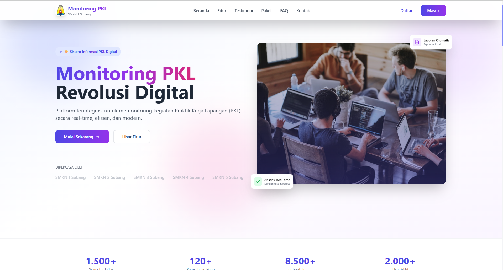
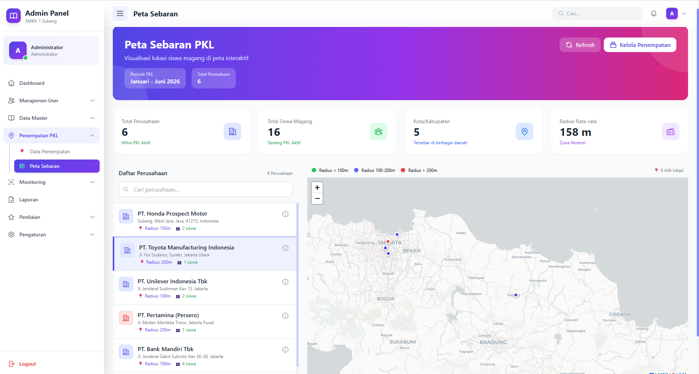
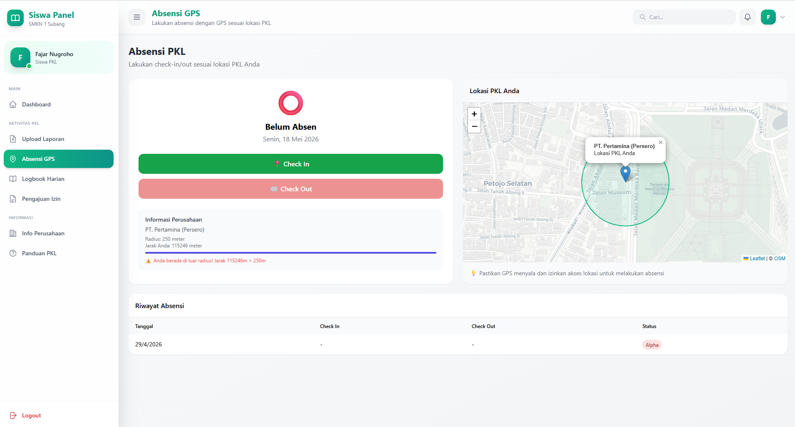
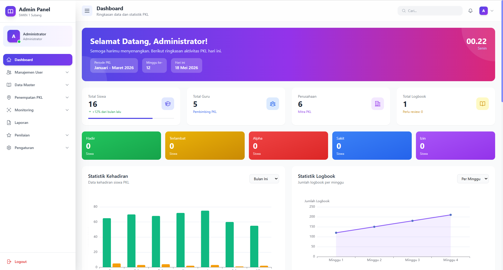

<div align="center">

# MONITORINGv2

### Sistem Informasi Monitoring Praktik Kerja Lapangan
### SMKN 1 Subang


<br>

**MONITORINGv2** adalah platform digital terintegrasi yang dirancang khusus untuk mendigitalisasi seluruh proses monitoring Praktik Kerja Lapangan (PKL) di SMKN 1 Subang. Menggantikan sistem manual semi-digital dengan arsitektur modern berbasis Single Page Application (SPA) yang responsif, real-time, dan interaktif.

Sistem ini melayani **empat aktor** — Admin, Siswa, Guru, dan Perusahaan (DUDI) — masing-masing dengan portal eksklusif, hak akses terdefinisi, serta fitur yang dirancang sesuai kebutuhan spesifik setiap peran.

</div>

---

## Daftar Isi

- [Sekilas Tentang](#sekilas-tentang)
- [Fitur Unggulan](#fitur-unggulan)
- [Teknologi](#teknologi)
- [Arsitektur Sistem](#arsitektur-sistem)
- [Tampilan Aplikasi](#tampilan-aplikasi)
- [Role Pengguna](#role-pengguna)
- [Panduan Penggunaan](#panduan-penggunaan)
- [Struktur Database](#struktur-database)
- [Panduan Instalasi](#panduan-instalasi)
- [Endpoint API](#endpoint-api)
- [Kontributor](#kontributor)

---

## Sekilas Tentang

**MONITORINGv2** hadir sebagai solusi menyeluruh untuk menjawab tantangan monitoring PKL di era digital. Dengan memanfaatkan teknologi geolokasi, sistem ini memungkinkan validasi kehadiran siswa secara real-time melalui metode **geofencing** menggunakan **rumus Haversine**, sehingga memastikan siswa benar-benar berada di lokasi perusahaan saat melakukan presensi.

### Latar Belakang

Proses monitoring PKL secara manual memiliki banyak kendala: data tersebar, sulit diverifikasi, komunikasi terbatas, serta pembuatan laporan yang memakan waktu. MONITORINGv2 menjawab semua tantangan tersebut dengan menyediakan satu platform terpadu yang menghubungkan sekolah, siswa, dan dunia industri.

### Tujuan

1. Mendigitalkan seluruh proses monitoring PKL dari hulu ke hilir
2. Memvalidasi kehadiran siswa secara real-time menggunakan teknologi GPS
3. Menjembatani komunikasi dan kolaborasi antara sekolah, siswa, dan perusahaan mitra
4. Menghasilkan laporan PKL yang akurat, real-time, dan dapat diekspor dalam berbagai format
5. Meningkatkan transparansi, akuntabilitas, dan efektivitas pelaksanaan PKL

---

## Fitur Unggulan

### Manajemen Pengguna & Role
Sistem mendaftarkan pengguna dalam empat peran berbeda — Admin, Siswa, Guru, Perusahaan — masing-masing dengan dashboard, fitur, dan hak akses yang terisolasi. Registrasi dilakukan secara mandiri melalui form publik dengan sistem approval oleh Admin.

### Absensi Berbasis GPS (Geofencing)
Fitur presensi masuk dan pulang menggunakan koordinat GPS real-time dari perangkat siswa. Validasi lokasi menggunakan **rumus Haversine** untuk menghitung jarak antara posisi siswa dengan koordinat perusahaan. Jika jarak berada dalam radius yang telah ditentukan, kehadiran dianggap valid. Dilengkapi foto dokumentasi dan status kehadiran (Hadir, Terlambat, Alpha, Sakit, Izin).

### Jurnal Harian (Logbook)
Siswa dapat mencatat kegiatan harian selama PKL secara terstruktur, lengkap dengan lampiran file (gambar, PDF, dokumen). Fitur ini dilengkapi dengan alur review oleh Guru dan penilaian oleh Perusahaan, memastikan kualitas pencatatan kegiatan.

### Pengajuan Izin & Sakit
Siswa dapat mengajukan izin atau sakit dengan melampirkan bukti pendukung. Guru pembimbing akan menerima notifikasi dan dapat menyetujui atau menolak pengajuan disertai alasan.

### Penempatan Siswa (Placement)
Admin dapat menempatkan siswa ke perusahaan mitra dengan menentukan periode PKL (tanggal mulai dan selesai), serta menunjuk Guru pembimbing yang bertanggung jawab.

### Penilaian Multi-Dimensi
Penilaian mencakup enam aspek kompetensi: Absensi, Logbook, Laporan, Sikap, Kinerja, dan Kedisiplinan. Penilaian dilakukan oleh Guru dan Perusahaan secara terpisah, memberikan gambaran objektif tentang performa siswa.

### Peta Sebaran Interaktif
Visualisasi sebaran siswa dan lokasi perusahaan pada peta interaktif berbasis **Leaflet.js**. Setiap marker menampilkan informasi detail perusahaan beserta daftar siswa yang ditempatkan di lokasi tersebut.

### Ekspor Laporan Excel
Sistem menyediakan fitur ekspor laporan dalam format Excel (.xlsx) untuk berbagai keperluan:
- Rekap absensi siswa
- Rekap logbook kegiatan
- Ringkasan data siswa
- Nilai akhir penilaian

### Notifikasi In-App
Sistem notifikasi terintegrasi yang memberi tahu pengguna tentang berbagai peristiwa penting: approval registrasi, review logbook, persetujuan izin, dan pengingat kegiatan.

### Laporan Akhir PKL
Siswa dapat mengunggah laporan akhir PKL lengkap dengan judul dan abstrak. Guru pembimbing dapat mereview, memberikan catatan revisi, dan menyetujui laporan.

---

## Teknologi

### Backend

| Teknologi | Versi | Kegunaan |
|-----------|-------|----------|
| PHP | ^8.3 | Bahasa pemrograman backend |
| Laravel | ^13.0 | Framework PHP dengan arsitektur MVC |
| MySQL | 8.x | Sistem manajemen basis data relasional |
| Laravel Sanctum | ^4.3 | Autentikasi API berbasis token |
| Maatwebsite/Laravel-Excel | ^3.1 | Ekspor data ke format Excel (.xlsx) |

### Frontend

| Teknologi | Versi | Kegunaan |
|-----------|-------|----------|
| Vue.js 3 (Composition API) | ^3.3 | Framework frontend reaktif dengan Composition API |
| Pinia | ^2.1 | Manajemen state terpusat |
| Vue Router 4 | ^4.2 | Routing SPA dengan navigation guards |
| Axios | ^1.5 | HTTP client dengan interceptor untuk token |
| Tailwind CSS 3 | ^3.3 | Utility-first CSS framework untuk styling cepat |
| Vite | ^4.4 | Build tool modern dengan HMR cepat |
| Leaflet.js | ^1.9 | Peta interaktif untuk visualisasi sebaran |
| ApexCharts / Chart.js / ECharts | — | Library grafik dan chart interaktif |
| vue-toastification | ^2.0 | Notifikasi toast yang responsif |

### Algoritma Kunci

**Haversine Formula** — Algoritma yang digunakan untuk menghitung jarak geodesik antara dua titik koordinat di permukaan bumi. Implementasi ini memungkinkan validasi apakah siswa berada dalam radius geofencing perusahaan saat melakukan presensi.

```
a = sin²(Δlat/2) + cos(lat1) · cos(lat2) · sin²(Δlng/2)
c = 2 · atan2(√a, √(1-a))
d = R · c

R = 6.371 km (radius bumi)
```

---

## Arsitektur Sistem

### Pola Arsitektur

Sistem menggunakan arsitektur **RESTful API + SPA** (Single Page Application) dengan pemisahan total antara frontend dan backend:

```
┌─────────────────────────────────────────────────────────────┐
│                   CLIENT (Web Browser)                       │
│  ┌───────────────────────────────────────────────────────┐  │
│  │            Vue 3 Single Page Application              │  │
│  │  ┌──────────────┐  ┌──────────┐  ┌────────────────┐ │  │
│  │  │  Pinia Store  │  │  Router  │  │  Axios Client  │ │  │
│  │  └──────────────┘  └──────────┘  └────────────────┘ │  │
│  │  ┌──────────────────────────────────────────────────┐ │  │
│  │  │  Layouts: Admin | Guru | Siswa | Perusahaan      │ │  │
│  │  └──────────────────────────────────────────────────┘ │  │
│  └───────────────────────────────────────────────────────┘  │
│                          │  HTTPS / JSON                     │
└─────────────────────────────────────────────────────────────┘
                           │
┌─────────────────────────────────────────────────────────────┐
│                 LARAVEL REST API (Backend)                    │
│  ┌───────────────────────────────────────────────────────┐  │
│  │  Routes → Middleware (auth:sanctum) → Controllers     │  │
│  │  ┌──────────────────────────────────────────────────┐ │  │
│  │  │  Controllers: Auth | Admin | Guru | Siswa | Perusahaan │  │
│  │  └──────────────────────────────────────────────────┘ │  │
│  │  ┌──────────────────────────────────────────────────┐ │  │
│  │  │  Models (Eloquent ORM) → Database (MySQL)        │ │  │
│  │  └──────────────────────────────────────────────────┘ │  │
│  └───────────────────────────────────────────────────────┘  │
└─────────────────────────────────────────────────────────────┘
```

### Alur Data Presensi (Geofencing)

```
Siswa                    Browser                       Laravel API
  |                        |                              |
  |── Klik Check-in ──────>|                              |
  |                        |── POST /check-in (lat,lng) ──>|
  |                        |                              |── Ambil data perusahaan
  |                        |                              |── Hitung jarak (Haversine)
  |                        |                              |── Validasi dalam radius?
  |                        |<── Response JSON ────────────|
  |<── Notifikasi ─────────|                              |
```

---

## Tampilan Aplikasi

<div align="center">

### Beranda (Landing Page)

<p><em>Halaman utama yang menyambut pengguna dengan desain modern dan informatif</em></p>

### Peta Sebaran Interaktif

<p><em>Visualisasi lokasi perusahaan dan sebaran siswa menggunakan Leaflet.js dengan marker interaktif</em></p>

### Absensi Radius (Geofencing)

<p><em>Presensi check-in/check-out dengan validasi radius menggunakan GPS dan rumus Haversine</em></p>

### Dashboard Admin

<p><em>Dashboard admin dengan statistik lengkap, grafik kehadiran, dan aktivitas terbaru</em></p>

</div>

---

## Role Pengguna

### Admin
Aktor dengan wewenang penuh atas sistem. Bertanggung jawab mengelola seluruh data master, memantau kegiatan PKL secara real-time, menyetujui registrasi akun baru, mengatur konfigurasi sistem, serta menghasilkan laporan untuk kebutuhan evaluasi.

**Fitur utama:**
- Dashboard dengan statistik komprehensif (total siswa, guru, perusahaan, placement aktif)
- Manajemen data pengguna (CRUD siswa, guru, admin)
- Manajemen data perusahaan mitra (nama, alamat, koordinat GPS, radius geofencing)
- Manajemen kelas dan jurusan
- Penempatan siswa ke perusahaan dengan periode dan guru pembimbing
- Monitoring absensi, logbook, dan progres siswa secara real-time
- Peta sebaran interaktif (Leaflet)
- Approval registrasi pengguna baru
- Penilaian dan review data siswa
- Ekspor laporan ke Excel (absensi, logbook, ringkasan, nilai)
- Konfigurasi sistem (profil sekolah, tahun ajaran, radius presensi)

### Siswa
Aktor utama yang menjalani PKL. Siswa menggunakan sistem untuk melakukan presensi harian, mencatat kegiatan, mengajukan izin, serta mengunggah laporan akhir.

**Fitur utama:**
- Dashboard personal dengan statistik kehadiran dan progres
- Presensi GPS check-in dan check-out dengan validasi radius
- Jurnal harian (logbook) dengan lampiran file
- Pengajuan izin dan sakit
- Upload laporan PKL dan final report
- Informasi detail perusahaan tempat PKL
- Riwayat presensi dan logbook

### Guru
Aktor yang membimbing dan memantau siswa selama PKL. Guru memiliki akses untuk mereview logbook, menyetujui izin, menilai siswa, serta mengekspor laporan.

**Fitur utama:**
- Dashboard monitoring siswa bimbingan
- Daftar siswa bimbingan dengan detail progres
- Review dan approval logbook dengan feedback
- Approval pengajuan izin/sakit
- Penilaian multidimensi (6 aspek kompetensi)
- Rekap absensi siswa bimbingan
- Review laporan akhir PKL
- Ekspor laporan ke Excel

### Perusahaan (DUDI)
Aktor dari pihak dunia industri yang membimbing siswa selama PKL. Perusahaan berperan dalam menilai logbook dan memantau progres siswa.

**Fitur utama:**
- Dashboard progres siswa bimbingan
- Penilaian logbook (grade 0-100 + feedback)
- Monitoring aktivitas siswa
- Ekspor laporan logbook dan progres

---

## Panduan Penggunaan

### Login
1. Buka aplikasi melalui browser
2. Klik tombol **Login** pada halaman utama
3. Masukkan **email** dan **password** yang telah terdaftar
4. Sistem akan mengarahkan ke dashboard sesuai role pengguna

### Registrasi
1. Klik tombol **Daftar** pada halaman utama
2. Pilih peran (Siswa, Guru, atau Perusahaan)
3. Isi formulir pendaftaran dengan data lengkap
4. Kirim pendaftaran — akun akan masuk dalam status **Pending**
5. Admin akan menyetujui atau menolak pendaftaran
6. Anda akan mendapat notifikasi melalui email atau in-app notification

### Presensi (Siswa)
1. Pastikan lokasi GPS perangkat aktif
2. Buka menu **Presensi** pada dashboard siswa
3. Klik tombol **Check-in** saat tiba di lokasi perusahaan
4. Sistem akan memvalidasi lokasi — pastikan berada dalam radius perusahaan
5. Klik tombol **Check-out** saat pulang
6. Riwayat presensi dapat dilihat pada menu histori

### Logbook (Siswa)
1. Buka menu **Logbook** pada dashboard siswa
2. Klik **Tambah Baru** untuk mencatat kegiatan
3. Isi judul kegiatan, deskripsi, dan lampirkan file jika diperlukan
4. Kirim logbook — status akan **Pending** hingga direview
5. Cek status review dan feedback pada menu yang sama

---

## Struktur Database

Database `monitoring_pkl` terdiri dari 12 tabel utama yang saling terintegrasi:

### Diagram Relasi

```
roles ──1:N──> users
classes ──1:N──> users
companies ──1:N──> users
companies ──1:N──> placements
companies ──1:N──> attendances
users ──1:N──> placements
users ──1:N──> attendances
users ──1:N──> logbooks
users ──1:N──> permissions
users ──1:N──> reports
users ──1:N──> final_reports
users ──1:N──> notifications
users ──1:N──> assessments
```

### Deskripsi Tabel

| Tabel | Deskripsi | Key Fields |
|-------|-----------|------------|
| `roles` | Definisi peran pengguna | id, name (Admin=1, Siswa=2, Guru=3, Perusahaan=4) |
| `users` | Seluruh pengguna sistem (polimorfik) | id, name, email, password, role_id, company_id, class_id, teacher_id, nisn, nip, is_active, photo, registration_status |
| `companies` | Data perusahaan mitra (DUDI) | id, name, address, latitude, longitude, radius |
| `classes` | Data kelas dan jurusan | id, name, jurusan, tingkat, teacher_id, academic_year |
| `placements` | Penempatan siswa ke perusahaan | id, student_id, company_id, teacher_id, start_date, end_date, status |
| `attendances` | Catatan presensi harian | id, user_id, company_id, date, check_in, check_out, check_in_lat/lng, check_out_lat/lng, status, photo, is_valid_location |
| `logbooks` | Jurnal kegiatan harian | id, user_id, date, activity, description, attachment, status, grade, feedback |
| `permissions` | Pengajuan izin/sakit | id, user_id, date, type, reason, attachment, status |
| `assessments` | Penilaian multidimensi | id, student_id, assessor_id, assessor_type, *score fields (6 aspek), final_score |
| `reports` | Upload laporan PKL | id, user_id, file_path, file_name, file_size, status |
| `final_reports` | Laporan akhir PKL | id, student_id, title, abstract, file_path, status, revision_notes |
| `notifications` | Notifikasi in-app | id, user_id, title, message, type, url, is_read |

---

## Panduan Instalasi

### Prasyarat Sistem

| Prasyarat | Versi Minimal |
|-----------|---------------|
| PHP | 8.3 |
| Composer | 2.x |
| Node.js | 18.x |
| npm | 9.x |
| MySQL | 8.0 |
| Web Server | Apache / Nginx |

### Langkah Instalasi

#### 1. Clone Repositori

```bash
git clone https://github.com/muadzie/MONITORING-V2.git
cd MONITORING-V2/monitoring-pkl-backend
```

#### 2. Instal Dependensi Backend

```bash
composer install
```

#### 3. Konfigurasi Environment

```bash
cp .env.example .env
```

Sesuaikan konfigurasi database pada file `.env`:

```env
DB_CONNECTION=mysql
DB_HOST=127.0.0.1
DB_PORT=3306
DB_DATABASE=monitoring_pkl
DB_USERNAME=root
DB_PASSWORD=
```

#### 4. Generate Application Key

```bash
php artisan key:generate
```

#### 5. Buat Database

```bash
mysql -u root -e "CREATE DATABASE IF NOT EXISTS monitoring_pkl"
```

#### 6. Jalankan Migrasi

```bash
php artisan migrate
```

#### 7. (Opsional) Seed Data Awal

```bash
php artisan db:seed
```

#### 8. Instal Dependensi Frontend

```bash
cd ../monitoring-pkl-frontend
npm install
```

#### 9. Jalankan Aplikasi

**Terminal 1 — Backend:**
```bash
cd monitoring-pkl-backend
php artisan serve
```

**Terminal 2 — Frontend:**
```bash
cd monitoring-pkl-frontend
npm run dev
```

#### 10. Akses Aplikasi

| Komponen | URL |
|----------|-----|
| Frontend (Development) | http://localhost:5173 |
| Backend API | http://localhost:8000/api |

---

## Endpoint API

### Autentikasi

| Method | Endpoint | Deskripsi | Auth |
|--------|----------|-----------|------|
| POST | `/api/login` | Login pengguna | Tidak |
| POST | `/api/logout` | Logout (hapus token) | Sanctum |
| GET | `/api/me` | Data pengguna saat ini | Sanctum |

### Registrasi (Publik)

| Method | Endpoint | Deskripsi |
|--------|----------|-----------|
| POST | `/api/register/siswa` | Registrasi akun siswa |
| POST | `/api/register/guru` | Registrasi akun guru |
| POST | `/api/register/perusahaan` | Registrasi akun perusahaan |

### Admin (`/api/admin`)

| Method | Endpoint | Deskripsi |
|--------|----------|-----------|
| GET | `/dashboard/stats` | Statistik dashboard admin |
| GET | `/dashboard/recent-activities` | Aktivitas terbaru |
| GET | `/dashboard/top-students` | Siswa dengan performa terbaik |
| CRUD | `/users` | Manajemen seluruh pengguna |
| CRUD | `/students` | Manajemen data siswa |
| CRUD | `/teachers` | Manajemen data guru |
| CRUD | `/companies` | Manajemen data perusahaan |
| CRUD | `/classes` | Manajemen data kelas |
| CRUD | `/placements` | Manajemen penempatan siswa |
| GET | `/registrations/pending` | Registrasi menunggu persetujuan |
| POST | `/registrations/{id}/approve` | Menyetujui registrasi |
| POST | `/registrations/{id}/reject` | Menolak registrasi |
| GET | `/monitoring/attendance` | Data monitoring absensi |
| GET | `/monitoring/logbook` | Data monitoring logbook |
| GET | `/monitoring/progress` | Data progres siswa |
| GET | `/map/data` | Data peta sebaran |
| GET | `/reports/attendance` | Ekspor Excel rekap absensi |
| GET | `/reports/logbook` | Ekspor Excel rekap logbook |
| GET | `/reports/summary` | Ekspor Excel ringkasan siswa |
| GET | `/reports/grade` | Ekspor Excel nilai akhir |
| GET/POST | `/settings/*` | Konfigurasi sistem |

### Siswa (`/api/siswa`)

| Method | Endpoint | Deskripsi |
|--------|----------|-----------|
| GET | `/dashboard/stats` | Statistik dashboard personal |
| POST | `/attendance/check-in` | Presensi masuk (dengan GPS) |
| POST | `/attendance/check-out` | Presensi pulang (dengan GPS) |
| POST | `/attendance/photo` | Upload foto saat presensi |
| GET | `/attendance/today` | Data presensi hari ini |
| GET | `/attendance/history` | Riwayat presensi |
| CRUD | `/logbooks` | Kelola jurnal harian |
| CRUD | `/permissions` | Kelola pengajuan izin/sakit |
| POST | `/report/upload` | Upload laporan PKL |
| CRUD | `/final-reports` | Kelola laporan akhir |
| GET | `/company` | Informasi perusahaan |
| GET | `/company/location` | Koordinat lokasi perusahaan |

### Guru (`/api/guru`)

| Method | Endpoint | Deskripsi |
|--------|----------|-----------|
| GET | `/dashboard/stats` | Statistik dashboard guru |
| GET | `/monitoring` | Daftar siswa bimbingan |
| GET | `/logbooks/pending` | Logbook yang perlu direview |
| PUT | `/logbooks/{id}/approve` | Menyetujui logbook |
| PUT | `/logbooks/{id}/reject` | Menolak logbook |
| PUT | `/logbooks/{id}/review` | Review logbook dengan feedback |
| GET | `/permissions/pending` | Izin/sakit yang perlu disetujui |
| PUT | `/permissions/{id}/approve` | Menyetujui izin/sakit |
| PUT | `/permissions/{id}/reject` | Menolak izin/sakit |
| CRUD | `/assessments` | Penilaian siswa |
| GET | `/attendances/summary` | Rekap absensi siswa |
| GET | `/reports/attendance` | Ekspor Excel absensi |
| GET | `/reports/logbook` | Ekspor Excel logbook |
| GET | `/reports/assessment` | Ekspor Excel penilaian |

### Perusahaan (`/api/perusahaan`)

| Method | Endpoint | Deskripsi |
|--------|----------|-----------|
| GET | `/dashboard/stats` | Statistik dashboard perusahaan |
| GET | `/logbooks/pending` | Logbook yang perlu dinilai |
| PUT | `/logbooks/{id}/grade` | Memberikan nilai logbook |
| POST | `/logbooks/{id}/feedback` | Memberikan feedback logbook |
| GET | `/progress` | Progres siswa bimbingan |
| GET | `/reports/logbook` | Ekspor laporan logbook |
| GET | `/reports/progress` | Ekspor laporan progres |

### Shared (Semua Role)

| Method | Endpoint | Deskripsi |
|--------|----------|-----------|
| GET/PUT | `/api/profile` | Lihat dan update profil |
| PUT | `/api/profile/password` | Ubah password |
| POST | `/api/profile/photo` | Upload foto profil |
| DELETE | `/api/profile/photo` | Hapus foto profil |
| GET | `/api/notifications` | Daftar notifikasi |
| GET | `/api/notifications/unread` | Notifikasi belum dibaca |
| PUT | `/api/notifications/{id}/read` | Tandai notifikasi sudah dibaca |
| PUT | `/api/notifications/read-all` | Tandai semua sudah dibaca |
| CRUD | `/api/assessments` | Kelola penilaian |

---

## Struktur Direktori

```
V2server2/
├── DOKUMENTASI.txt                          # Dokumentasi teknis
├── README.md                                # File ini
├── foto/                                    # Screenshot aplikasi
│   ├── absensi_radius.png
│   ├── beranda.png
│   ├── dashboard_admin.png
│   └── peta_sebaran.png
├── monitoring-pkl-backend/                  # Backend Laravel
│   ├── app/
│   │   ├── Constants/RoleConstants.php      # Konstanta ID role
│   │   ├── Console/Commands/                # Artisan commands
│   │   │   ├── AutoFillAttendance.php
│   │   │   ├── CheckAlphaAttendance.php
│   │   │   └── FixPlacementTeacherId.php
│   │   ├── Exports/                         # Export classes (Excel)
│   │   ├── Helpers/
│   │   │   ├── HaversineHelper.php          # Rumus Haversine
│   │   │   └── helpers.php                  # Fungsi global
│   │   ├── Http/Controllers/Api/
│   │   │   ├── AuthController.php
│   │   │   ├── Admin/                       # ~12 controllers
│   │   │   ├── Guru/                        # ~7 controllers
│   │   │   ├── Siswa/                       # ~6 controllers
│   │   │   └── Perusahaan/                  # ~3 controllers
│   │   ├── Models/                          # 12+ Eloquent models
│   │   └── Providers/
│   ├── database/
│   │   ├── migrations/                      # 28 migration files
│   │   └── monitoring_pkl (3).sql           # Database dump
│   ├── routes/
│   │   ├── api.php                          # 314+ baris route API
│   │   └── web.php                          # SPA catch-all
│   ├── composer.json
│   └── artisan
└── monitoring-pkl-frontend/                 # Frontend Vue 3
    └── src/
        ├── layouts/                         # Layout per role
        │   ├── AdminLayout.vue
        │   ├── GuruLayout.vue
        │   ├── SiswaLayout.vue
        │   └── PerusahaanLayout.vue
        ├── views/
        │   ├── admin/                       # ~15 halaman admin
        │   ├── guru/                        # ~10 halaman guru
        │   ├── siswa/                       # ~10 halaman siswa
        │   └── perusahaan/                  # ~5 halaman perusahaan
        ├── components/                      # Komponen bersama
        ├── stores/                          # Pinia stores
        ├── router/                          # Vue Router config
        └── App.vue
```

---

## Kontributor

<div align="center">
  <table>
    <tr>
      <td align="center">
        <strong>Ilham Muadz Fakhrizi</strong><br>
        <em>Pengembang & Desainer Sistem</em><br>
        <a href="mailto:muadzie@gmail.com">muadzie@gmail.com</a>
      </td>
    </tr>
  </table>
</div>

### Pengembang

| Nama | Peran | Kontak |
|------|-------|--------|
| **Ilham Muadz Fakhrizi** | Full-Stack Developer & System Designer | muadzie@gmail.com |

### Tech Stack Attribution

- [Laravel](https://laravel.com) — Framework backend
- [Vue.js](https://vuejs.org) — Framework frontend
- [Tailwind CSS](https://tailwindcss.com) — CSS framework
- [Leaflet](https://leafletjs.com) — Library peta interaktif
- [ApexCharts](https://apexcharts.com) — Library grafik
- [Laravel Sanctum](https://laravel.com/docs/sanctum) — Autentikasi API

---

<div align="center">
  <p>
    Hak Cipta &copy; 2026 <strong>Ilham Muadz Fakhrizi</strong><br>
    Dikembangkan untuk SMKN 1 Subang — Sistem Informasi Monitoring Praktik Kerja Lapangan
  </p>
  <p>
    <sub>Dilarang memperbanyak, mendistribusikan, atau menggunakan sebagian atau seluruh<br>
    konten aplikasi ini tanpa izin tertulis dari pengembang.</sub>
  </p>
  <br>
  <p>
    <b>SMKN 1 Subang</b> — Jl. Arief Rahman Hakim No. 35, Subang, Jawa Barat
  </p>
</div>
